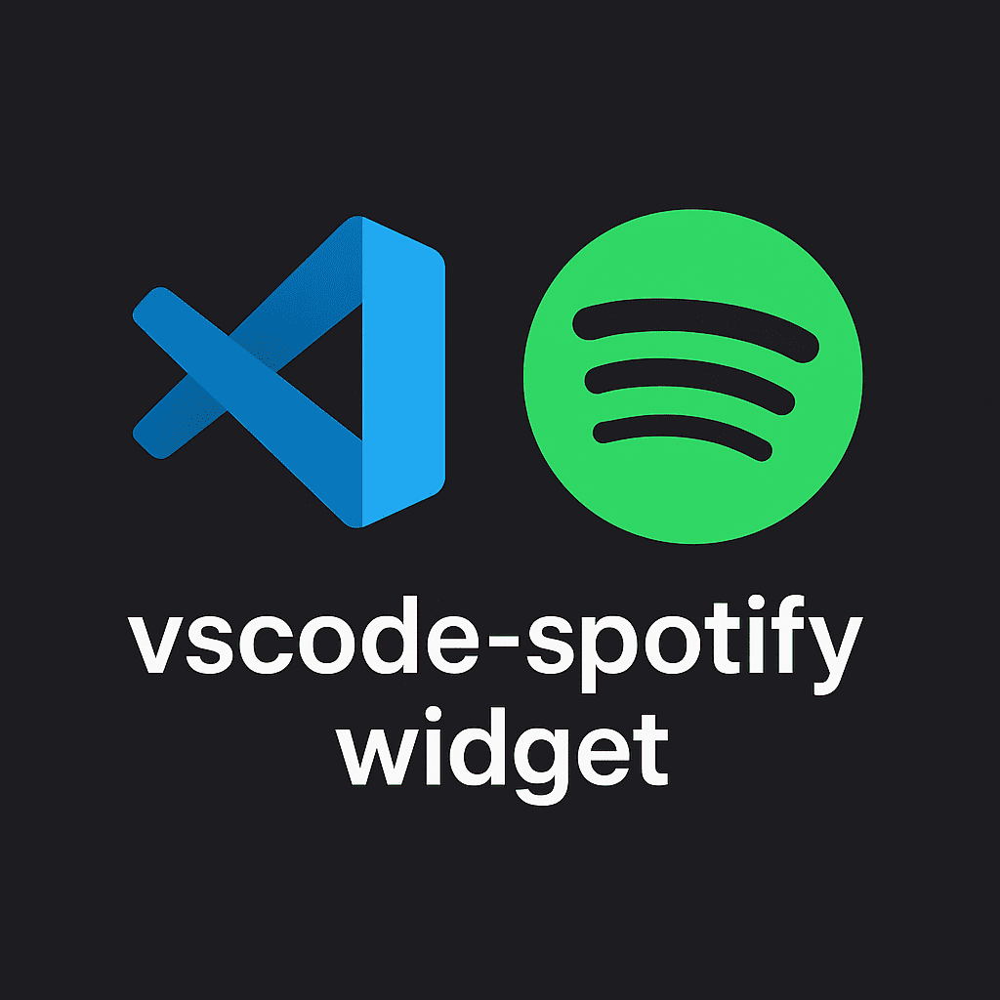

# Spotify VS Code Widget

<p align="center">
  
</p>

A beautiful Spotify player widget for Visual Studio Code that displays your currently playing track with playback controls, designed to look like the Spotify mobile app.

## Features

- 🎵 Real-time display of currently playing track
- 🎨 Spotify mobile app-inspired design
- ⏯️ Cross-platform playback controls (Play/Pause, Next, Previous)
- ⚡ Low-latency native media key control via robotjs
- 🌐 Automatic Web API fallback for reliability
- 📊 Progress bar with time display
- 🖼️ Album artwork display
- 🔄 Fast auto-refresh (1 second updates)
- 🔐 Secure PKCE authentication

## Setup Instructions

### 1. Create a Spotify Application (One Time Setup)

1. Go to [Spotify Developer Dashboard](https://developer.spotify.com/dashboard)
2. Log in with your Spotify account
3. Click "Create app"
4. Fill in the details:
   - **App name**: VS Code Spotify Widget (or any name)
   - **App description**: Personal Spotify widget
   - **Redirect URI**: `https://anunayj.github.io/vscode-spotify-widget-auth/`
   - **Which API/SDKs are you planning to use?**: Web API
5. Save and open your app settings
6. Copy your **Client ID** (NOT the Client Secret!)

### 2. Configure VS Code

1. Open VS Code Settings (`Ctrl+,` or `Cmd+,`)
2. Search for "Spotify Widget"
3. Paste your **Client ID** into `Spotify Widget: Client Id`

### 3. Authenticate

1. Open Command Palette (`Ctrl+Shift+P` or `Cmd+Shift+P`)
2. Type "Authenticate with Spotify" and press Enter
3. Click "Open Spotify Login"
4. Log in to Spotify and authorize the app
5. Copy the authorization code from the page
6. Paste it back into VS Code
7. Done! 🎉

## Commands

- `Spotify Widget: Authenticate with Spotify` - Log in to your Spotify account
- `Spotify Widget: Show` - Show the Spotify widget panel
- `Spotify Widget: Hide` - Hide the Spotify widget panel

## Configuration

```json
{
  "spotifyWidget.clientId": "your_client_id_here",
  "spotifyWidget.callbackUrl": "https://anunayj.github.io/vscode-spotify-widget-auth/",
  "spotifyWidget.refreshInterval": 1000
}
```

- **clientId**: Your Spotify App Client ID
- **callbackUrl**: OAuth callback URL (must match your Spotify app redirect URI)
- **refreshInterval**: Update frequency in milliseconds (default: 1000ms)

## Requirements

- Active Spotify account (Free or Premium)
- Spotify app must be playing music
- Internet connection

## Security

- Your Client ID is stored securely in VS Code settings
- Client Secret is NOT needed (uses PKCE flow)
- Access tokens are stored locally and never shared
- No third-party servers involved

## Troubleshooting

### "Not authenticated" message
- Run "Authenticate with Spotify" command
- Make sure you set your Client ID in settings

### Slow updates
- Reduce refresh interval in settings (minimum 500ms recommended)
- Default is 1000ms for balance between speed and API limits

### Token expired
- Tokens last 1 hour
- Just re-authenticate when needed (takes 10 seconds)

## Known Limitations
- Track information updates may have a slight delay
- Playback controls require an active Spotify session (via app or web player)
- Native media key support (robotjs) requires native compilation during install and may not work on headless systems or some Linux distributions; automatically falls back to Web API if unavailable

## Development

### Working on the Extension
1. Clone the repository
2. Install platform-specific dependencies for robotjs (optional but recommended):
   - **Windows**: `npm install --global --production windows-build-tools` (from elevated PowerShell)
   - **macOS**: Xcode Command Line Tools (pre-installed on most systems)
   - **Linux**: `sudo apt-get install libxtst-dev libpng++-dev`
3. Run `npm install`
4. Press `F5` to start debugging
5. The Extension Development Host will open with the extension loaded

### Building Platform-Specific Packages
The extension uses platform-specific native modules (robotjs) for optimal performance. Multi-platform VSIX packages are automatically built by GitHub Actions:
- Windows (x64)
- macOS (x64 and ARM64)
- Linux (x64)

To build locally for your platform:
```bash
npm install -g @vscode/vsce
vsce package --target <platform>-<arch>
# Examples: win32-x64, darwin-x64, darwin-arm64, linux-x64
```

## Contributing

Contributions are welcome! Please feel free to submit a Pull Request.

## Credits
- Developed by [itsnotalexy](https://github.com/itsnotalexy)
- This project is not affiliated with Spotify AB. Any use of Spotify's API and trademarks is done in accordance with their [Developer Terms of Service](https://developer.spotify.com/terms/).